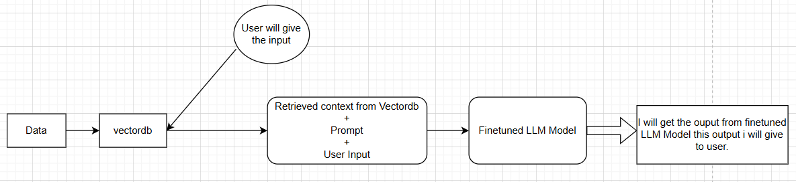

# Serverless LLM Application with Fine-Tuning on AWS SageMaker & Deployment Using Lambda, API Gateway, S3, and DynamoDB

This project demonstrates a fully serverless Large Language Model (LLM) pipeline, where a foundation model is fine-tuned using AWS SageMaker and deployed for inference using AWS Lambda and API Gateway. The system is integrated with S3 for model storage and DynamoDB for metadata and logging.

Fine-tuning: Retraining and adapting a pretrained LLM on domain-specific data using techniques like PEFT (LoRA/QLoRA) to significantly reduce compute cost while improving model quality. 

## Problem Statement

* Enterprises want to leverage LLMs for domain-specific tasks such as summarization, Q&A, report generation, chatbots, etc., but training and hosting these models on traditional servers is expensive, complex, and difficult to scale.

* There is a need for a cost-efficient, serverless, and fully managed LLM solution that can be fine-tuned on enterprise-specific data like internal knowledge bases, PDFs, reports, FAQs, and more.

* The goal is to fine-tune LLMs and expose them securely via APIs for easy integration with applications.

* In this project, I performed instruction fine-tuning on my own domain-specific dataset using AWS SageMaker and stored the trained model in Amazon S3.

* After fine-tuning, I implemented a RAG (Retrieval Augmented Generation) workflow:

    * Convert user queries into embeddings

    * Pass embeddings to a vector database

    * Retrieve relevant context

    * Provide retrieved context + user query to the fine-tuned LLM for accurate responses

## Project Workflow

**Stage 1: Model Training (Fine-Tuning)**

Fine-tune a base LLM on domain-specific data using SageMaker and PEFT techniques. After training, the optimized model is saved to Amazon S3.

**Stage 2: Model Deployment & Inference**

Deploy the fine-tuned model using a SageMaker inference endpoint. The endpoint is then consumed through a serverless architecture using:

* AWS Lambda

* AWS API Gateway

* RAG pipeline for contextual improvement

This enables real-time predictions with low latency and minimal infrastructure management.

### Architecture

## Technologies Used

* Python

* LangChain

* Streamlit

* HuggingFace Transformers

* AWS Services:

    * SageMaker

    * S3

    * DynamoDB

    * Lambda

    * API Gateway

    * CloudWatch

* For step-by-step process. Follow the steps.docx or steps.pdf file
    * https://github.com/Anuragreddy-Naredla/Finetuning-on-aws/blob/master/steps.docx
    * https://github.com/Anuragreddy-Naredla/Finetuning-on-aws/blob/master/steps.pdf
